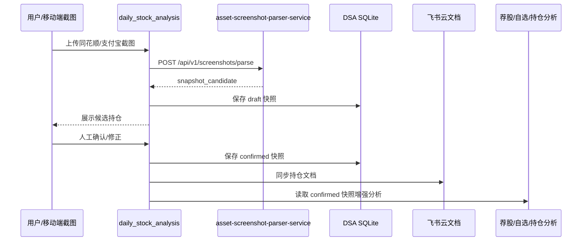

# daily_stock_analysis 上线部署与实战方案

本文描述如何把 `daily_stock_analysis` 主服务部署上线，并在生产实践中接入已部署的 `asset-screenshot-parser-service`，将截图持仓识别结果用于日常荐股、自选股分析、持仓分析和提醒。

`asset-screenshot-parser-service` 已作为独立 OCR/parser 服务部署完成，本方案不重复规划它的上线；这里的上线对象是 `daily_stock_analysis`。

## 1. 目标

- 用独立 asset parser 服务承接 OCR、截图分类和 parser 规则。
- `daily_stock_analysis` 只负责上传入口、候选快照入库、人工确认、飞书文档同步和后续分析。
- 通过人工确认后的持仓快照增强自选股分析和持仓风险视图。
- 保持截图快照和原 `portfolio` 交易账本隔离，避免 OCR 噪声污染交易流水。

## 2. 推荐生产拓扑

```text
Mobile / Browser / Feishu
  -> daily_stock_analysis Web/API :8000
      -> local SQLite / data volumes
      -> email / Feishu notification
      -> asset-screenshot-parser-service :8010
          -> umi-ocr 127.0.0.1:1224
```

推荐部署形态：

- 低配云服务器推荐使用 Python venv + systemd 部署，避免在 2GB 内存机器上构建前端和 Docker 镜像导致 OOM。
- Docker Compose 适合内存更充足或已有镜像仓库的环境；若使用 Docker，仍需挂载 `data/`、`logs/`、`reports/`。
- `asset-screenshot-parser-service` 作为外部 HTTP 依赖，通过 `ASSET_PARSER_BASE_URL` 调用。
- WebGUI 对外开放建议走安全组白名单或 Nginx 反向代理。
- 数据目录 `data/`、`logs/`、`reports/` 必须持久化。
- `.env` 不入库，生产密钥只放服务器环境或部署密钥管理中。

当前腾讯云试运行实例：

- 主服务路径：`/opt/daily_stock_analysis`
- Web/API 服务：`daily-stock-analysis-server`，监听 `0.0.0.0:8000`
- 调度服务：`daily-stock-analysis-scheduler`，每日分析时间 `18:00`
- asset parser 服务：`asset-screenshot-parser-service`，`http://127.0.0.1:8010`
- OCR 容器：`umi-ocr`，仅绑定 `127.0.0.1:1224`
- 持久化目录：`/opt/daily_stock_analysis/data`、`/opt/daily_stock_analysis/logs`、`/opt/daily_stock_analysis/reports`

## 3. 服务边界

`asset-screenshot-parser-service` 负责：

- `POST /api/v1/screenshots/parse`
- OCR provider 调用，目前为 Umi-OCR HTTP。
- 同花顺股票/ETF、支付宝基金手机截图 parser。
- 模板和案例管理。
- 返回 `snapshot_candidate.summary` 与 `snapshot_candidate.positions`。

`daily_stock_analysis` 负责：

- Web/API 上传截图。
- 调用 asset parser HTTP 接口。
- 把结果保存为 `draft` 外部持仓快照。
- 让用户确认或修正后再变为 `confirmed`。
- 将确认快照同步到飞书云文档。
- 将确认后的股票/ETF 用于分析范围、风险提示和价格提醒。

## 4. 推荐配置

```env
EXTERNAL_HOLDINGS_ENABLED=true
ASSET_PARSER_ENABLED=true
ASSET_PARSER_BASE_URL=https://asset-parser.example.com
ASSET_PARSER_API_KEY=<asset-parser-api-key>
ASSET_PARSER_TIMEOUT_SECONDS=90

HOLDING_SCREENSHOT_REMINDER_ENABLED=true
HOLDING_SCREENSHOT_REMINDER_STOCK_TIME=15:10
HOLDING_SCREENSHOT_REMINDER_FUND_TIME=21:00
HOLDING_SCREENSHOT_REMINDER_CHANNELS=feishu,email
HOLDING_SCREENSHOT_DOC_SYNC_ENABLED=true
HOLDING_SCREENSHOT_AUTO_MERGE_STOCK_LIST=false
HOLDING_SCREENSHOT_STALE_REMINDER_HOURS=24
```

兼容说明：

- 旧配置 `ASSET_SCREENSHOT_PARSER_SERVICE_*` 仍可读取。
- 旧配置 `OCR_SERVICE_*` 仅保留兼容，不建议继续作为新部署入口。
- `HOLDING_SCREENSHOT_AUTO_MERGE_STOCK_LIST` 默认关闭，避免 OCR 结果未经人工确认就进入 `STOCK_LIST`。

主服务还需要配置：

- `STOCK_LIST`：每日荐股/自选股分析主范围。
- `SCHEDULE_ENABLED=true`：开启定时任务。
- `SCHEDULE_TIME`：每日分析时间。
- LLM 配置：至少配置一个可用模型通道。
- 新闻搜索配置：至少配置一个搜索源，例如 `TAVILY_API_KEYS` / `BOCHA_API_KEYS` / `SERPAPI_API_KEYS`。
- 通知配置：至少配置飞书或邮件中的一个。

当前试运行状态：

- 已启用飞书 Webhook 通知。
- 已启用 163 邮箱 SMTP 通知；当前代码会按 `163.com` 自动使用 `smtp.163.com:465 SSL`。
- 已启用飞书云文档同步，`FEISHU_FOLDER_TOKEN` 来自飞书云盘文件夹链接中的 folder token；当前 `HOLDING_SCREENSHOT_DOC_SYNC_ENABLED=true`。
- 飞书文件夹写入权限通过“应用机器人进群 -> 文件夹授权给该群且可编辑”解决，测试快照已成功生成云文档。
- Web 管理端已启用 `ADMIN_AUTH_ENABLED=true`，首次访问需要设置管理员密码。

## 5. daily_stock_analysis 上线步骤

推荐最小上线步骤：

1. 在服务器准备 `/opt/daily_stock_analysis`。
2. 拉取 `main` 或正式 tag，不从未合并的功能分支部署生产。
3. 创建 `.env`，填入股票列表、LLM、搜索、通知、asset parser、调度配置。
4. 在低配服务器上创建 Python venv，安装依赖，并用 systemd 启动 Web/API 和定时分析服务。
5. 检查 WebGUI、健康接口、日志目录和数据库文件。
6. 手动跑一次截图上传链路，确认可生成 `draft` 快照。
7. 手动确认快照，确认能查到 latest confirmed。
8. 验证飞书和邮件通知。
9. 打开定时任务，让系统进入日常运行。

建议部署命令以仓库现有 `docs/DEPLOY.md`、`docs/deploy-webui-cloud.md` 和实际服务器资源为准。当前腾讯云试运行环境建议优先使用 systemd；等服务稳定后，再考虑发布镜像并切换为 Docker Compose。

## 6. 上线检查清单

上线前：

- asset parser 的 `GET /api/v1/health` 返回 `ocr_provider=umi_http`。
- `daily_stock_analysis` WebGUI 可访问。
- `daily_stock_analysis` 数据目录已持久化。
- `daily_stock_analysis` 已配置 `EXTERNAL_HOLDINGS_ENABLED=true`。
- `daily_stock_analysis` 已配置 `ASSET_PARSER_ENABLED=true` 和 `ASSET_PARSER_BASE_URL`。
- 若 asset parser 设置了 API Key，`ASSET_PARSER_API_KEY` 已配置且不入库。
- 用同花顺和支付宝各一张真实截图跑通 `/api/v1/external-holdings/extract-from-image`。
- 确认 `draft -> confirm -> latest -> doc-sync` 闭环可用。

上线后：

- 每日按提醒上传同花顺股票/ETF 持仓截图。
- 每日或每周上传支付宝基金持仓截图。
- 确认快照后再同步飞书文档。
- 对无法识别、低置信度或 warnings 非空的快照做人工复核。

## 7. 实战流程



## 8. 与荐股和自选股分析的关系

当前最稳妥的策略是“确认后使用”：

- `STOCK_LIST` 仍是每日分析主入口。
- 外部持仓快照提供“我实际持有什么”的上下文。
- 当截图中识别出股票/ETF 但 `STOCK_LIST` 没有时，先在 UI/飞书中提示“建议加入自选”，不自动写入。
- 若用户确认并启用自动合并，再把股票/ETF 代码追加到 `STOCK_LIST`。
- 支付宝基金持仓优先用于资产概览和基金风险提示，不直接进入股票荐股列表。

推荐分层：

| 数据 | 来源 | 用途 |
| --- | --- | --- |
| `STOCK_LIST` | 用户配置 | 每日个股分析主范围 |
| `confirmed external holdings` | 截图确认快照 | 持仓上下文、风险提示、资产概览 |
| `portfolio ledger` | 手工交易流水 | 成本法、收益率和交易回放 |
| `watchlist suggestions` | 截图中新增股票/ETF | 人工确认后再加入自选 |

## 9. 持仓分析最佳实践

- 只读取 `status=confirmed` 的外部持仓快照参与正式分析。
- `draft` 快照只用于 UI 复核，不进入报告或提醒。
- 多平台快照分开保存，再在分析层汇总。
- 价格提醒以股票/ETF 的 `symbol` 为主；`symbol` 缺失时只显示名称，不触发自动价格提醒。
- 对基金类资产展示持有金额、持有收益和收益率，不强行套用股票买卖信号。
- 如果同一资产同时出现在交易账本和截图快照，优先标记“来源不同”，不要自动合并成本。

## 10. 告警和提醒

推荐提醒分三类：

- 截图更新提醒：按 `HOLDING_SCREENSHOT_REMINDER_*` 提醒你上传最新截图。
- 持仓价格提醒：基于 confirmed 股票/ETF 持仓的 `symbol` 和最新行情触发。
- 分析提醒：每日报告中突出“持仓股”和“自选未持仓股”的差异。

价格提醒建议：

- 股票/ETF 只对有 `symbol` 的 confirmed 持仓启用。
- 基金持仓不做实时价格提醒，只在截图更新后汇总收益变化。
- 单日内同一标的提醒要做冷却，避免行情震荡刷屏。

## 11. 日常运营 SOP

每日：

- 定时分析任务自动读取最新 `STOCK_LIST`。
- 收到截图提醒后上传同花顺持仓截图。
- 生成 `draft` 后人工核对持仓名称、代码、市值、盈亏。
- 确认快照并同步飞书文档。
- 查看报告里“持仓股”和“仅自选股”的差异。

每周：

- 上传支付宝基金持仓截图。
- 检查基金持仓收益变化和风险集中度。
- 复核 `STOCK_LIST` 是否需要加入或移除标的。
- 检查 `data/`、`logs/`、`reports/` 目录大小和备份状态。

每次新增平台：

- 先在 asset parser 服务新增截图类型和案例。
- `daily_stock_analysis` 只增加枚举、展示文案和确认流程适配。
- 不在主项目内复制 OCR/parser 规则。

## 12. 故障处理

| 问题 | 检查点 | 处理 |
| --- | --- | --- |
| 上传后提示未配置服务 | `ASSET_PARSER_ENABLED` / `ASSET_PARSER_BASE_URL` | 补齐配置并重启服务 |
| 401 | `ASSET_PARSER_API_KEY` | 确认与 asset parser 服务端 `API_KEY` 一致 |
| 识别超时 | `ASSET_PARSER_TIMEOUT_SECONDS` / Umi-OCR 容器状态 | 先调到 90 秒，检查 Umi-OCR CPU/内存 |
| positions 为空 | 截图类型不支持或图片模糊 | 新增案例，扩展 asset parser |
| symbol 为空 | 名称无法映射代码 | 人工确认或补全本地名称映射 |
| WebGUI 无法访问 | `WEBUI_HOST` / 云防火墙 / systemd 服务 / Docker 端口 | 参考 `docs/deploy-webui-cloud.md` 检查 8000 端口 |
| 定时任务未运行 | `SCHEDULE_ENABLED` / `SCHEDULE_TIME` / systemd 或容器日志 | 检查日志并确认服务器时区 |
| 飞书或邮件未推送 | 通知配置 / webhook / SMTP | 使用通知测试接口或手动触发一次分析 |

## 13. 迭代路线

第一阶段：上线可用

- 配置 asset parser HTTP 接入。
- 截图上传生成 draft。
- 人工确认后保存 confirmed。
- 飞书文档同步最新 confirmed 快照。

第二阶段：分析增强

- 日报中区分“持仓股”和“仅自选股”。
- 对 confirmed 持仓股增加持仓风险摘要。
- 对截图新增股票/ETF 给出“加入自选”建议。

第三阶段：提醒增强

- confirmed 持仓价格移动提醒。
- 持仓截图 stale 提醒。
- 基金持仓周度收益变化摘要。

第四阶段：更多平台

- 通过 asset parser 的模板和案例体系新增截图类型。
- 每个新平台至少沉淀 3-5 张真实截图案例。
- 新平台只扩展 asset parser，`daily_stock_analysis` 只增加枚举和展示文案。
